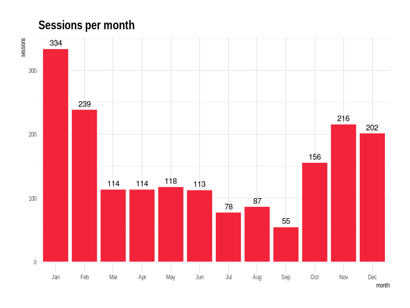
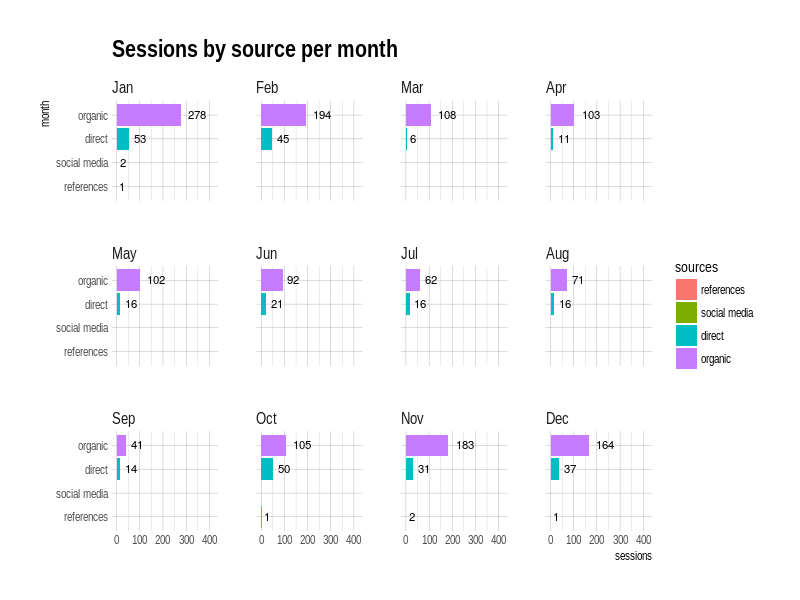

# googleAnalyticsReports

The goal of googleAnalyticsReports is to clean data from GA API and generate some standard plots for you.

This package expects that the user already has data from GA, and especially, that this data has a column: `sourceMedium` to work on. This means that in order tu clean the data, `sourceMedium` must be present as a dimension in the call to the API. 

You could use the `googleAnalyticsR` from Mark Edmonson to make a call like the following to the `GA API`:

```r 

library(googleAnalyticsR)

ga_auth()

my_accounts <- ga_account_list()
View(my_accounts)

my_id <- 123456789 #use your view id here 

start_date <- "2018-01-01"
final_date <- "2018-01-31"

my_data <- google_analytics_4(my_id, 
                              date_range = c(start_date, final_date),
                              metrics = "sessions",
                              dimensions = c("date", "sourceMedium"))

```


##The main functions are:

1. `ga_clean_data()`  #cleans the sourceMedium column 

1. `ga_sessions_*` functions to generate plots using ggplot2 as plotting library, for example: `ga_sessions_per_month` and `ga_sessions_per_month_s` (this not only returns the total sessions by month but also lets you identify the right sources for them).


## Cleaning Google Analytics Data

This is a basic example which shows you how to clean the sourceMedium column using: `ga_clean_data()`.

`ga_clean_data()` acepts the following arguments:

* data: data to be cleaned.
* language: desired language for your sources. For now the only options are `en` and `es`. Defaults to `en`.
* remove_spam: defaults to `TRUE` and removes all data considerd to be spam. If you would like to check that the function labels correctly these source, you can set it to `FALSE` and do a manual checking.


``` r

## use data sample for demostration

data(gadata) #load sample data contained in package

cleaned_data <- ga_clean_data(gadata)

head(cleaned_data , n=6) 

# A tibble: 6 x 5
  date       source                 medium   sessions sources
  <date>     <chr>                  <chr>       <dbl> <chr>       
1 2017-07-01 google                 organic      1.00 organic     
2 2017-07-03 google                 organic      6.00 organic     
3 2017-07-04 google                 organic      1.00 organic     
4 2017-07-05 (direct)               (none)       2.00 direct      
5 2017-07-05 earn-from-articles.com referral     3.00 spam        
6 2017-07-05 google                 organic      6.00 organic

```


#Sessions per month

After cleaning the data with you can call `ga_sessions_per_month()` to generate a graph showing the total sessions by month. 

Thi function accepts these arguments:

* title: title of the plot
* x_title: title for the x axis.
* y_title: title for the y axis.
* label_size: size of the label for each column.
* bars_fill: should the RGB color desired for the bars.




#Sessions by source per month

`ga_sessions_per_month_s()` plots all sessions by month and by source. The fill of the bars is the variable `sources` from the data frame you passed as argument. This data frame should have been cleaned with `ga_clean_data()`.

Note the final "s" in the function.

Thi function accepts these arguments:

* title: title of the plot
* x_title: title for the x axis.
* y_title: title for the y axis.
* label_size: size of the label for each column.




